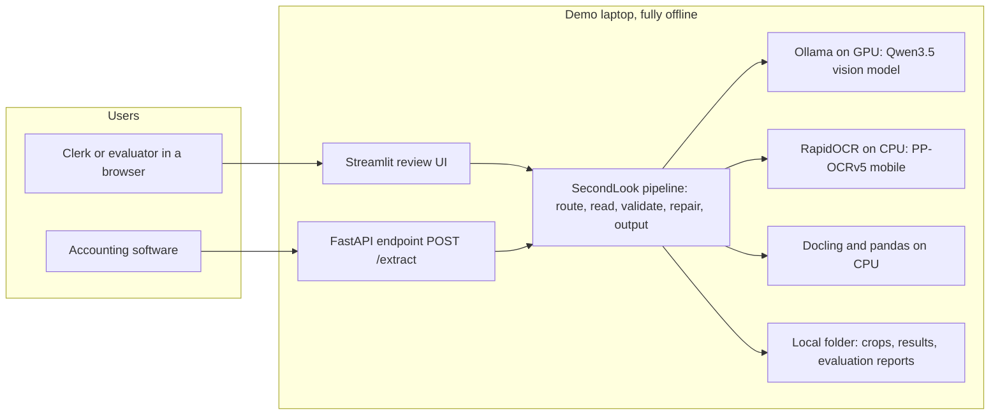
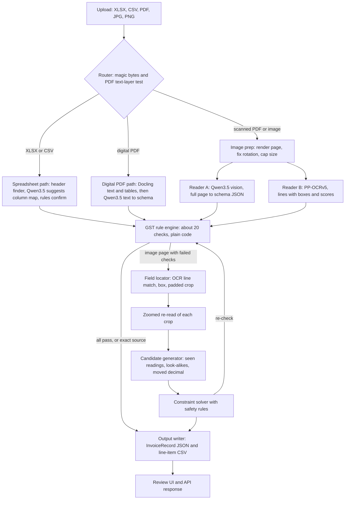
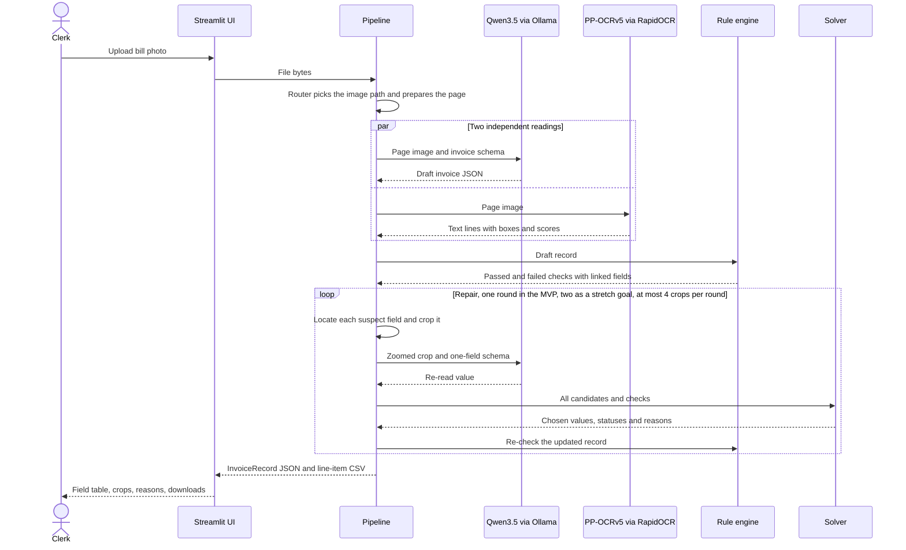
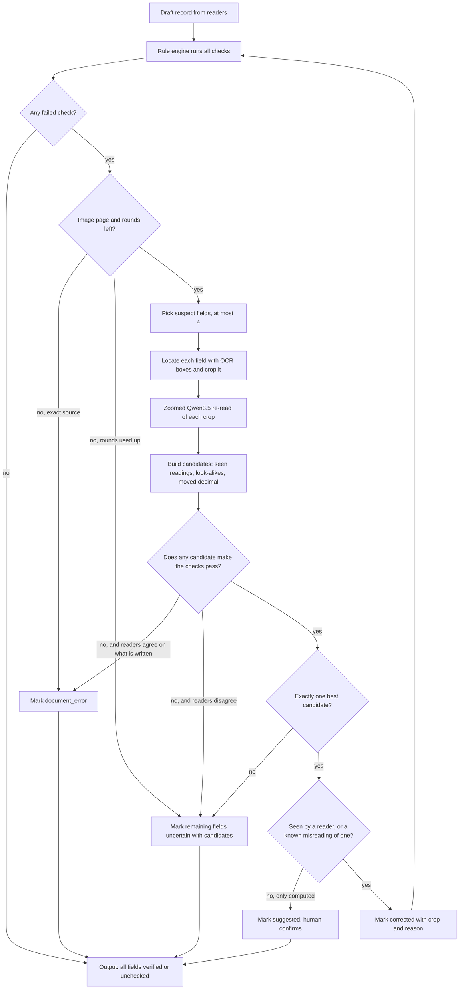

# SecondLook

**Problem Statement 3: VYOM+ – End-to-End AI-Powered GST Invoice Intelligence System**

*This is our qualifier proposal. Nothing is built yet. We build it at the finals on 10 October 2026, so every
performance number below is a target, not a result.*

---

## 1. Project Name

**SecondLook**: GST invoice reading that fixes misread handwriting using the invoice's own maths, and says "check
this" when it can't prove the fix.

SecondLook takes GST invoices in any of the five formats PS 3 lists (Excel, CSV, PDF, JPG, PNG) and turns them into
checked, machine-readable records. We're focusing on the hardest case, handwritten bills. A GST invoice already contains
its own cross-checks: the GSTIN has a check character, CGST must equal SGST, and the lines must add up to the total. When
a reading breaks one of these checks, SecondLook zooms in on that part of the page and reads it again. It only accepts a
fix if exactly one reading (or a known misreading of it, like O for 0) makes the maths work. Otherwise it hands the field
to a person with the options listed. It all runs offline on a laptop.

---

## 2. Problem Statement

PS 3 asks for "an end-to-end invoice intelligence system for VYOM+ that can accept different invoice and transaction
document formats, process them using an appropriate AI pipeline, and convert them into accurate, validated,
machine-readable financial records". Its stated main focus is "improving handwritten GST invoice processing while
maintaining strong performance on printed and digitally generated invoices". Section 4 maps every bullet to our design.

The real problem behind it: lots of small Indian businesses still write invoices by hand in pre-printed bill books
(pads with the shop's name and GSTIN printed at the top), for things like kirana stock, building material and
transport. Every month, clerks at CA firms type these into accounting software field by field.

AI readers can do most of that typing now, but they still get things wrong in ways that matter for accounts:

- They confuse look-alike characters and drop decimal points, reading "O" as "0" in a GSTIN or "1180.00" as "11800".
  Vendors in this space list these as the usual handwriting errors ([AI Accountant](https://www.aiaccountant.com/blog/handwritten-invoice-processing-india)).
- They invent values. Vision-language models can report numbers that aren't on a blurry invoice
  ([Seeing is Believing?, NeurIPS 2025](https://arxiv.org/abs/2506.20168)), and a 2026 benchmark caught models that
  "alter the price of a line item" so the totals match ([ReceiptBench, §5.3](https://arxiv.org/html/2605.22413v1)).
  That hides the error instead of fixing it.
- The open-source GST tools we looked at check GSTINs and arithmetic, but when a check fails they just flag it, and
  none of them mention handwriting ([gst-einvoice-mcp](https://github.com/411sst/gst-einvoice-mcp),
  [Gst-Invoice-Assistant](https://github.com/Ashutosh0945/Gst-Invoice-Assistant)).
- There's no public dataset of handwritten Indian GST invoices
  ([Kaggle thread](https://www.kaggle.com/general/543743), [HF forum](https://discuss.huggingface.co/t/seeking-indic-document-dataset-india-invoices-receipts-utility-bills-payment-advices-packing-lists-commercial-invoices-credit-notes/177055)),
  so hardly anyone can show measured handwriting accuracy.

We want a handwritten GST bill to come out as a record an accountant can trust, without someone re-checking every
field and without the AI changing numbers it never saw.

---

## 3. Project Overview

SecondLook is a five-stage pipeline: route, read, validate, repair, output. The open-source models do the reading and
re-reading, and our code checks those readings against GST maths and decides what to keep.

It accepts XLSX, CSV, PDF (digital or scanned), JPG/JPEG and PNG, either through a web page or an API. For each invoice
it returns an `InvoiceRecord` JSON, where every field has a value, a status, a confidence, a source and a reason, plus a
CSV of the line items. The models are Qwen3.5 (a small vision-language model served by Ollama), PP-OCRv5 mobile (OCR,
run through RapidOCR) and Docling. Everything runs on one ordinary laptop with a 4 GB consumer GPU (e.g. an RTX 3050),
with no hosted model and no API keys. To prove it works, we'll label a test set and report handwritten vs printed
accuracy, before and after repair, from a single command.

---

## 4. Proposed Solution

We identify each file by its first bytes and send it down one of four paths: spreadsheet, digital PDF, scanned PDF or
image. Spreadsheets and digital PDFs are read exactly. Scans and photos get two independent readings: Qwen3.5 reads the
whole page into our invoice schema, and PP-OCRv5 returns every text line with its position and a confidence score. A
rule engine (plain code, no AI) then runs about 20 GST checks. On image pages, every field that fails gets cropped,
re-read zoomed in, and handed to a small solver along with all the other candidate values.

### Rules for repair

We'd rather flag a field than change it wrongly, so repair follows three rules:

1. If more than one candidate passes the checks, we change nothing and show all of them.
2. A value only counts as `corrected` if a model actually read it (full-page read, OCR line or zoomed re-read), or if
   it's a known misreading of such a reading: one look-alike character swapped (O/0, I/1, S/5, B/8, Z/2, for GSTINs in
   the MVP and for amounts as a stretch goal) or one decimal point moved. A value that only the maths supports is
   `suggested`, and a person has to confirm it. This stops the ReceiptBench problem of a model changing a price so the
   totals match.
3. We make the smallest change possible: at most one character per GSTIN, and at most one amount per group of linked
   amounts.

Sometimes the bill itself is wrong. If the zoomed re-read and the OCR both agree on what's written and the maths still
fails, the field becomes `document_error`, meaning the supplier's own arithmetic is off. That gets flagged, not
changed.

### What the clerk sees

| Status | Meaning | What the clerk does |
|---|---|---|
| `verified` | Passed every check involving this field, or came from an exact text layer or spreadsheet | Nothing |
| `corrected` | Changed by repair under the rules above | Glance at the crop and reason |
| `suggested` | Only the maths supports this value; no reader saw it | Confirm or edit |
| `uncertain` | No single answer. Candidates are listed | Pick or type the value |
| `document_error` | Readers agree on what's written, but the bill's maths is wrong | Raise it with the supplier |
| `unchecked` | No check covers this field (names, addresses, descriptions). Reader agreement is shown | Read it if it matters |

### How each PS 3 requirement is met

| PS 3 text (word for word) | How SecondLook meets it |
|---|---|
| Input formats: "Excel (.xlsx), CSV, PDF, JPEG / JPG, PNG" | One upload box and one API endpoint take all five. The router splits PDFs into digital and scanned |
| "Identify the type of input and route it through an appropriate processing pipeline." | Router: first-bytes check plus a PDF text-layer test |
| "For Excel/CSV, organize the available information into a clean and structured tabular format." | Header-row finder, Qwen3.5 suggests the column mapping and rules confirm it, Indian number formats like "13,81,105.16" parsed, rows grouped into invoices |
| "For PDFs and images, extract the relevant invoice and GST information and convert it into structured records." | Digital PDFs: Docling text into Qwen3.5. Scans and photos: Qwen3.5 vision plus PP-OCRv5 |
| "Extract important invoice, GST, tax, financial, and line-item information." | One schema built from [CBIC Rule 46](https://taxinformation.cbic.gov.in/content/html/tax_repository/gst/rules/cgst_rules/active/chapter6/rule46_v1.00.html), the legal list of what a tax invoice must contain, including line items and the tax split |
| "Validate extracted information and identify or handle inconsistent or uncertain data where possible." | The rule engine finds problems; the repair loop fixes them or marks them `suggested`, `uncertain` or `document_error`, with a reason |
| "Return standardized machine-readable output such as JSON and/or structured tabular data." | `InvoiceRecord` JSON plus a line-item CSV, from the UI or `POST /extract` |
| "Provide a simple interface where an evaluator can upload documents and inspect the resulting structured information." | Streamlit page with the document beside a colour-coded field table, crops and reasons, downloads, and an Evidence tab |
| Main focus: "improving handwritten GST invoice processing while maintaining strong performance on printed and digitally generated invoices" | The repair loop is built for handwriting; printed pages that pass every check skip it. Results are reported handwritten vs printed, before vs after repair |
| "designed as a complete processing pipeline rather than only a text-recognition demo" | Reading is stage 2 of 5; most of the work is routing, validation, repair and evaluation |
| "turning real-world invoice documents into accurate and usable financial records" / "suitable for downstream accounting workflows" | Every field has a status a clerk can act on, and accounting software can call the API |
| "open-source or appropriately licensed OCR systems, vision-language models, document-understanding models, LLMs" | Qwen3.5 and RapidOCR/PP-OCRv5 (Apache 2.0), Docling (MIT); section 19 |

---

## 5. Objectives

These are targets for 10 October, not results.

1. Get all five formats working end to end, covering every PS 3 bullet, by 12:45 pm on the finals day. This is our
   floor.
2. Lower the silent error rate on handwritten bills, meaning key fields that are wrong and not flagged. That's the
   failure that actually costs money in accounting. Target: lower after repair than before, on our labelled set.
3. Keep repairs safe. Target: repair precision (correct fixes out of all fixes) of at least 95% on the synthetic solver
   stress test, and we'll report it on the real handwritten bills too.
4. Don't make printed and digital invoices worse. Target: their field accuracy is no lower after repair than before.
5. Stay usable on a laptop. Target: under 60 seconds per handwritten page on a laptop with a 4 GB GPU, and a few
   seconds for digital PDFs and spreadsheets.
6. Make it reproducible: one command re-runs the whole evaluation and prints the results table.

---

## 6. Target Users / Use Case

The main users are **data-entry clerks and article assistants at CA firms**, who type hundreds of mixed-format bills a
month. With SecondLook most fields arrive `verified` or `corrected` with a visible reason, so their attention only goes
to the `uncertain` and `document_error` ones.

Small business owners and their accountants can use it to digitise their own bill books cheaply and privately. It runs
offline on an ordinary gaming laptop, with no per-page fees, and no invoice leaves the office.

Accounting software such as VYOM+ needs a reliable machine-readable feed before vouchers are created. `POST /extract`
returns standard JSON with a status on every field, so the software can post the trusted fields automatically and queue
the rest for a person. And hackathon evaluators get one upload page where they can try any supported file.

Here's how we picture it in use (illustrative): a clerk in Nagpur gets a WhatsApp photo of a handwritten cement bill
and drops it into SecondLook. Within about a minute (target), 14 fields show as `verified`. The supplier GSTIN is
`corrected`, because a "0" had been read as "O", and the zoomed crop sits next to it. Line 2 is `document_error`:
4 x 95.00 is 380.00, but the bill says 400.00. She posts the record and calls the supplier about line 2.

---

## 7. Open-Source AI Technology Selected

| Component | What it is | Exact choice | Role in SecondLook |
|---|---|---|---|
| **Qwen3.5 small** | Open-weight vision-language model that reads images and text and can answer in a fixed JSON format | `qwen3.5:2b-q4_K_M` (1.9 GB) on a 4 GB GPU, `qwen3.5:4b-q4_K_M` (3.3 GB) with 6 GB ([Ollama tags](https://ollama.com/library/qwen3.5/tags)). Both are 4-bit quantized to save memory | Full-page reading into the invoice schema, zoomed re-reads of single fields, and text-only mapping of spreadsheet columns and digital-PDF text |
| **PP-OCRv5 mobile** | Classic two-step OCR: find the text lines, then read each one | Run through RapidOCR on ONNX Runtime (CPU), with v5 mobile pinned, since newer RapidOCR defaults to v6 ([model list](https://rapidai.github.io/RapidOCRDocs/main/model_list/)) | Finds where fields are on the page so we can crop them, and gives an independent second reading |
| **Docling** (IBM) | Document converter for PDFs and office formats | CPU only | Pulls the text layer and tables out of digital PDFs |
| **Ollama** | Local model server | Current stable release | Runs Qwen3.5 on the GPU and forces each reply to match our JSON schema ([structured outputs](https://docs.ollama.com/capabilities/structured-outputs)), at temperature 0 so answers repeat |
| Fallback reader | Older small vision model | `qwen3-vl:2b` (1.9 GB, [Ollama](https://ollama.com/library/qwen3-vl/tags)) | Only used if Qwen3.5 doesn't reliably return valid JSON with images (section 20) |

Exact versions of every tool will be pinned in the final repo.

We designed SecondLook for an ordinary laptop with a 4 GB GPU, so a small CA office doesn't need a server. The reader
model is just a setting: the 2B model on 4 GB (it leaves room for the image and the model's working memory), the 4B
model on 6 GB or more (IDP 74.5 vs 67.1), and `qwen3-vl:2b` on anything if Qwen3.5's output turns out to be unreliable.

Limits we're designing around:

- Small vision models can invent values on bad images, so we never trust their output directly.
- Qwen models up to 9B are poor at placing boxes on documents ([arXiv 2606.24118](https://arxiv.org/pdf/2606.24118)).
  That paper didn't test 2B/4B, but we don't expect better, so PP-OCRv5 finds field positions instead.
- PP-OCRv5 mobile is weaker on handwriting than the server model (0.777 vs 0.841,
  [PP-OCRv5 docs](https://paddlepaddle.github.io/PaddleOCR/main/en/version3.x/algorithm/PP-OCRv5/PP-OCRv5.html)), so
  it's our locator and second opinion, not the main reader.
- Ollama has had bugs where Qwen3.5's "thinking" setting stops the JSON schema being applied
  ([#14645](https://github.com/ollama/ollama/issues/14645), [#14716](https://github.com/ollama/ollama/issues/14716)).
  Thinking off plus a schema is a reported fix
  ([DEV write-up](https://dev.to/homelabpm/ollama-skips-your-json-schema-when-a-thinking-model-answers-without-thinking-2916)).
  Section 20 covers the fallback.

---

## 8. Why This Technology Was Selected

Each part is there for a specific job:

| Job | Chosen | Why, and what we ruled out |
|---|---|---|
| Read a messy handwritten page straight into a structured invoice, on a 4–6 GB GPU | Qwen3.5-2B/4B | Best scores among small open models on the [IDP Leaderboard](https://www.idp-leaderboard.org/): 74.5 (4B), 67.1 (2B). (It's run by a vendor, Nanonets, and has no handwriting-only scores.) It goes from image to schema JSON in one step. Gemma 4 E4B scores 55.0 and is too big for 4 GB; GLM-OCR and PaddleOCR-VL output plain text, so they'd need a second model; Qwen3.5-9B (76.2) won't fit |
| A second, independent reading, plus where each field is | PP-OCRv5 mobile via RapidOCR | A different kind of model makes different mistakes, which is what choosing between candidates needs, and it gives a box and confidence per line. RapidOCR runs it on a CPU without PaddlePaddle ([RapidOCR](https://github.com/RapidAI/RapidOCR)). Tesseract is poor on handwriting ([Extend.ai](https://www.extend.ai/resources/best-handwriting-ocr-tools-business)); TrOCR reads single lines of English cursive only |
| Exact text and tables from digital PDFs | Docling | Real text layer, so no OCR errors; keeps tables; offline on a CPU ([formats](https://docling-project.github.io/docling/usage/supported_formats/)). PyMuPDF is AGPL, so we avoided it |
| Run models locally with a guaranteed JSON shape | Ollama | One-command install and schema-forced output with images. llama.cpp gives more control but more setup |
| Coordinate the repair steps | Our own bounded loop | Predictable time per page on a small GPU. An agent framework like LangGraph would add cost and unpredictability for nothing here |

We went open source and local mainly because of the data. Invoices are full of GSTINs, prices and customer names, and
with local models none of it leaves the laptop. It also means no per-page fees for small firms, and we can pin the exact
model and run at temperature 0 so results repeat. The repair loop makes several small model calls per page, which costs
nothing locally but would hit cost and rate limits on a paid API. It also fits the final-round rule of "real
engineering, not only a call to a hosted model" [Tech doc].

---

## 9. AI's Role in the System

We can't turn a handwritten page into fields without a vision model, and we'd have no repair candidates without a
second OCR. The models do all the reading: the full page into our schema, the patches our checks flag, a second
independent reading, and the column mapping for messy spreadsheets. Our code then compares those readings and decides
what to keep, and it can say why.

| Task | Done by | Input → output |
|---|---|---|
| Read a full page into the invoice schema | Qwen3.5 (vision) | Page image + JSON schema → draft `InvoiceRecord` JSON |
| Read every text line with its position | PP-OCRv5 | Page image → list of (box, text, confidence) |
| Re-read one doubtful field, zoomed in | Qwen3.5 (vision) | Upscaled crop + one-field schema → one value |
| Map spreadsheet columns to invoice fields | Qwen3.5 (text) | Header names + sample rows → suggested mapping, then confirmed by rules |
| Turn digital-PDF text into fields | Qwen3.5 (text) | Docling text and tables → `InvoiceRecord` JSON |
| Route files, run GST checks, locate fields, generate candidates, choose values, set statuses | Our code (no AI) | Draft record + checks + candidates → final record with reasons |

---

## 10. System Architecture

Everything runs on one laptop. The UI and the API are just two ways into the same pipeline function.



The interface is Streamlit (upload, review, Evidence tab) plus FastAPI (`POST /extract`, which comes with a `/docs`
page for trying it out). Both call the same pipeline function, so they return the same thing. The pipeline itself (router,
readers, rule engine, repair loop, output writer, evaluation harness) is our code. Ollama serves Qwen3.5 on the GPU while
RapidOCR and Docling run on the CPU in parallel. Storage is plain files (crops, result JSON, evaluation tables).
We don't need a database at hackathon scale.

---

## 11. Component-Level Architecture



| Component | Built by us or library | What it does | Input → output |
|---|---|---|---|
| Schema | Ours (Pydantic) | Invoice fields from CBIC Rule 46, each with value, status, confidence, source, reason, candidates and crop | Sent to Ollama as the JSON schema; checks every reply |
| Router | Ours | Detects the format; tests whether a PDF has real text | File → path + pages or sheets |
| Spreadsheet mapper | Ours + pandas + Qwen3.5 (text) | Header row, column mapping, Indian numbers, grouping into invoices | Sheet → table + records |
| Digital PDF reader | Docling + Qwen3.5 (text) | Exact text and tables into the schema | PDF → record |
| Image prep | Ours + Pillow + pypdfium2 | Renders scanned pages, fixes rotation, limits size | File → page image |
| Reader A / Reader B | Qwen3.5 / PP-OCRv5 | Two independent readings | Image → draft record / OCR lines |
| Rule engine | Ours, exact decimals | Runs the checks; each one lists the fields it links | Record → passed / failed checks |
| Field locator | Ours + rapidfuzz | Matches a value or printed label ("Total", "GSTIN") to an OCR line and crops around it | Failed field → crop |
| Candidate generator | Ours | Every reading of a field, plus one-character look-alikes (O/0, I/1, S/5, B/8, Z/2; GSTINs in the MVP, amounts as a stretch goal) and moved decimals | Readings → candidates |
| Constraint solver | Ours | Most checks passed, then fewest changes, then most readers agreeing; applies the repair rules | Candidates → values, statuses, reasons |
| Output, UI, API | Ours + Streamlit + FastAPI | Writes JSON/CSV and shows results | Record → files, page, HTTP response |
| Evaluation harness | Ours | Compares draft and final records with the labels | Test set → metrics |

The rule engine's checks:

| Group | Checks |
|---|---|
| GSTIN (supplier and buyer) | 15-character pattern; check character (a Luhn mod-36 check, which catches any single-character substitution: [Luhn mod N](https://en.wikipedia.org/wiki/Luhn_mod_N_algorithm), [worked example](https://dev.to/tarun_vaghasia_a387e1ac9b/how-gstin-checksum-validation-works-and-why-it-isnt-enough-3l8e)); valid state code; PAN pattern inside the GSTIN |
| Invoice header | Rule 46 mandatory fields present; invoice number at most 16 characters; valid date |
| Each line | quantity × rate − discount = taxable value; tax rate allowed for the invoice date; line tax = taxable × rate |
| Totals | sum of line taxable values = invoice taxable value; CGST = SGST; never IGST together with CGST/SGST; tax = taxable × rate; taxable + taxes + cess ± round-off = grand total |
| Place of supply | Supplier state (first two GSTIN digits) vs place of supply decides CGST+SGST or IGST. Only a warning, since place of supply isn't always the buyer's state |

Tax rates depend on the invoice date. Since 22 September 2025 the main slabs are 0, 5, 18 and 40%. Before that they
were 0, 5, 12, 18 and 28% ([PIB, GST 2.0](https://static.pib.gov.in/WriteReadData/specificdocs/documents/2025/sep/doc202594628401.pdf)).
So 12% on a 2026 invoice is suspicious, but fine on one from August 2025. Rates outside both lists give a warning, not
an error. We'll start with rounding tolerances of ±0.01 per line and ±1 rupee on totals and tune them on the labelled
set.

How the solver finds the wrong field: an invoice has more checks than it strictly needs. A misread field breaks every
check it's part of, while the other fields in those checks are confirmed by checks that still pass. So the suspect is
the field that shows up in the failed checks but not in the passing ones. For each suspect the solver tries a few dozen
candidate combinations, keeps the best, and only accepts it if it passes the repair rules in section 4.

---

## 12. Data / Information Flow

The hardest path is a handwritten photo:



| Input | Path | AI used | Repair? | A failed check means |
|---|---|---|---|---|
| XLSX / CSV | Spreadsheet mapper, then the rule engine on each grouped invoice | Qwen3.5 (text) suggests the column mapping | No, the data is exact | `document_error` in the source data |
| Digital PDF | Docling, Qwen3.5 text, rule engine | Qwen3.5 (text) | No, the text layer is exact | `document_error` |
| Scanned PDF (page 1) / JPG / PNG | Image prep, both readers, rule engine, repair loop | Qwen3.5 (vision), PP-OCRv5 | Yes, only for failed fields | Repaired, `suggested`, `uncertain` or `document_error` |

Below is the output format we're planning, shortened. It's an illustration, not a result, and the GSTIN is made up
(though it does pass the check character).

```json
{
  "file": "bill_07.jpg",
  "route": "image",
  "invoice": {
    "supplier_gstin": {
      "value": "27ABCDE1234F1Z0",
      "status": "corrected",
      "confidence": "medium",
      "source": "zoom_reread_qwen",
      "reason": "Full-page read '27ABCDE1234F1ZO' failed the GSTIN check character. Of the look-alike variants allowed by the GSTIN pattern, only '27ABCDE1234F1Z0' passes. The zoomed re-read agrees.",
      "candidates": ["27ABCDE1234F1ZO", "27ABCDE1234F1Z0"],
      "crop": "crops/bill_07_supplier_gstin.png"
    },
    "taxable_value": { "value": "1000.00", "status": "verified", "confidence": "high", "source": "page_read_qwen",
      "reason": "Equals the sum of the line amounts. CGST and SGST checks pass." },
    "cgst": { "value": "90.00", "status": "verified", "confidence": "high", "source": "page_read_qwen",
      "reason": "9% of 1000.00. Equals SGST." },
    "sgst": { "value": "90.00", "status": "verified", "confidence": "high", "source": "page_read_qwen",
      "reason": "9% of 1000.00. Equals CGST." },
    "grand_total": {
      "value": "1180.00",
      "status": "corrected",
      "confidence": "medium",
      "source": "zoom_reread_qwen",
      "reason": "Full-page read 11800 failed 'taxable + CGST + SGST = grand total' (1000.00 + 90.00 + 90.00). All other fields in that check are confirmed by passing checks. Zoomed re-read: 1180.00, which passes. Unique, seen, one change.",
      "candidates": ["11800", "1180.00"],
      "crop": "crops/bill_07_grand_total.png"
    }
  },
  "line_items": [
    { "line": 1,
      "description": { "value": "Cement bag 50 kg", "status": "unchecked" },
      "qty": { "value": "2", "status": "verified" },
      "rate": { "value": "300.00", "status": "verified" },
      "taxable_value": { "value": "600.00", "status": "verified" } },
    { "line": 2,
      "description": { "value": "River sand bag", "status": "unchecked" },
      "qty": { "value": "4", "status": "document_error" },
      "rate": { "value": "95.00", "status": "document_error" },
      "taxable_value": { "value": "400.00", "status": "document_error",
        "reason": "Line check failed: 4 x 95.00 = 380.00, but the bill says 400.00. Zoomed re-read and OCR both confirm all three written values, so the supplier's own arithmetic is wrong. Nothing changed; the line is flagged." } }
  ],
  "checks_failed_before_repair": ["supplier_gstin.check_character", "totals.grand_total", "line_2.qty_x_rate"],
  "checks_failed_after_repair": ["line_2.qty_x_rate"]
}
```

---

## 13. Agentic Workflow (if applicable)

The repair step is a bounded loop: check, locate, re-read, solve, check again. It behaves like an agent in that it
notices a failure, picks an action and checks the result, but it isn't a free-running LLM agent. Our code
decides what to re-read and when to stop, not the model. That keeps the time per page predictable on a small GPU and
means every decision can be explained.



We limit it to 4 crops per page per round, with one round in the MVP and two as a stretch goal. Repair is skipped for
spreadsheets, digital PDFs and pages that pass every check on the first read. It only covers GSTINs, amounts, tax lines
and rates, because names, addresses and descriptions have no maths to check them against.

---

## 14. Technology Stack

| Layer | Technology | Why |
|---|---|---|
| Language | Python 3.12 | Every library below supports it |
| Vision-language model | Qwen3.5-2B (or 4B), quantized `q4_K_M` | Section 8 |
| Model server | Ollama | Local GPU inference with schema-forced JSON |
| OCR | RapidOCR + ONNX Runtime, PP-OCRv5 mobile pinned | Independent reader with boxes and scores, on the CPU |
| Digital PDF | Docling, with pypdfium2 text extraction as a fallback | Exact text and tables |
| PDF rendering | pypdfium2 | Turns scanned pages into images. Permissive licence, unlike PyMuPDF (AGPL) |
| Spreadsheets | pandas + openpyxl | Load XLSX/CSV and find the header row |
| Schema and validation | Pydantic v2, Python `decimal` | One schema for Ollama and for checking replies; exact money arithmetic |
| Fuzzy matching | rapidfuzz | Match field values and labels to OCR lines |
| Images | Pillow | Rotate, resize, crop, upscale crops |
| UI | Streamlit | Upload, tables, images, downloads and tabs with little code |
| API | FastAPI | `POST /extract` for other software, with a free `/docs` test page |
| Tests | pytest | Unit tests for the rule engine and the GSTIN check |

**Deployment.** One machine runs everything, offline: Ollama serves Qwen3.5 on the GPU, while RapidOCR, Docling,
Streamlit and FastAPI run on the CPU. We're targeting a laptop with a 4 GB GPU and 16 GB RAM. Only the reader needs the
GPU. The rest is plain Python, so we can build and test it on any machine using saved reader outputs.

---

## 15. Expected Features

What must work by 6 pm (the MVP):

1. One upload box for all five formats, routed automatically, with a clear "unsupported" message instead of a crash.
2. Spreadsheet cleaning: title rows skipped, columns mapped to invoice fields, Indian number formats parsed, rows grouped
   into invoices and validated with the same rules as everything else.
3. A GST rule engine with at least 12 checks (aiming for about 20), including the GSTIN check character and date-aware
   rates.
4. One round of handwriting repair: zoomed re-reads and GST maths fix misread GSTINs and amounts, with the crop and the
   reason shown, and the system holds back when there's no single answer. If zoomed crops aren't working by the 3:15 pm
   checkpoint, this becomes rules-only repair from the readings we already have (section 16).
5. The six statuses: `verified`, `corrected`, `suggested`, `uncertain`, `document_error`, `unchecked`.
6. A review page showing the document beside a colour-coded field table, with crops, reasons and JSON/CSV downloads.
7. `POST /extract`, returning the same JSON as the UI. It's a thin wrapper over the same pipeline function, so it costs
   little and we won't cut it.
8. An Evidence tab with measured before/after and handwritten/printed results, plus the solver stress test.

Stretch goals, only once the MVP is pushed and in this order:

- a second repair round
- a zoomed OCR re-read of each crop, as one more candidate
- marking amounts `uncertain` when the two readers disagree, even if the maths passes
- look-alike variants for amounts
- deskewing tilted photos
- batch upload in the API
- drawing the OCR boxes on the page image

---

## 16. Implementation Approach

We're four people, split by role, and each file has one owner so we don't fight merge conflicts. If someone's stuck
for 30 minutes they say so, and at 45 minutes they take the fallback or cut the item.

| Role | Owns |
|---|---|
| Reader engineer | Ollama and the speed test, image prep, full-page read, crops and zoomed re-read, the single pipeline function, driving the demo |
| Rules engineer | Shared schema, GSTIN check, rule engine and unit tests, candidate generator, solver, stress test |
| Formats engineer | Router, spreadsheet path, digital PDF path, OCR field locator, evaluation harness |
| Product engineer | Repo, README, licence, Streamlit UI and Evidence tab, FastAPI, test photos and labels, backup video, submission |

Finals-day plan (9:15 am to 6:00 pm, with lunch from 1 to 2):

| Time | What happens | Done when |
|---|---|---|
| 9:15–10:05 | Repo set up; model speed and JSON tested on one bill; GSTIN check written; schema agreed by 9:50. Meanwhile we write the handwritten test bills, each copied from an answer sheet so its labels exist before the photo | Seconds per page recorded |
| 9:45 | Checkpoint: under 60 s with valid JSON keeps the model; otherwise switch to the fallback | Model fixed for the day |
| 9:50–11:00 | Reader (saving its outputs so others can work without the GPU), rule engine with tests, router and digital PDF path, UI skeleton; test bills photographed | Reader outputs pushed |
| 11:00 | Checkpoint: one handwritten bill goes all the way through | Works, or two of us pair on it |
| 11:00–12:45 | Scanned PDFs, spreadsheets, remaining checks, API, labels typed in, all five formats integrated | All five formats run through the UI |
| 12:45 | Checkpoint: every PS 3 bullet works. If not, we finish it 2:00–2:30 and start repair with GSTIN look-alikes and moved decimals only | Tagged `v1-floor` |
| 2:00–3:00 | Repair loop: locator, crops, zoomed re-read, solver, repair UI | Right status on 4 hand-made cases |
| 3:00 | Checkpoint: repair works on a real bill. Fallback at 3:15: rules-only repair from the existing readings, still measured | A real bill gets `corrected` or `uncertain` with a reason |
| 3:00–4:30 | Amount repair, `document_error`, stress test, evaluation harness, first full run, fixes | Feature freeze at 4:30 |
| 4:30–5:00 | Final evaluation run, backup video, fresh-clone test of the run instructions | Numbers in the README |
| 5:00–6:00 | Two timed rehearsals; submission from 5:30 | Submitted |

MVP items don't get cut. If we fall behind, the checkpoint fallbacks shrink an item rather than drop it, and stretch
goals stop wherever we are. We're leaving out agent frameworks, chat, login, a database, Docker, cloud hosting,
fine-tuning, other models, Hindi or Marathi handwriting, and invoices that run across pages (we read page 1 and warn
about the rest).

---

## 17. Expected Final Output

By 6 pm a judge should be able to drop an Excel export, a digital PDF and a photo of a handwritten bill into one page on
our laptop, with no internet, and get checked GST records for each. On the handwritten bill, SecondLook should correct
a misread GSTIN and a misread total, with the crop and the reason, and leave a planted arithmetic mistake by the shopkeeper
alone, marking it `document_error`. We'll pick the demo bill from real runs and won't edit any output to stage it. If
no bill gives a clean correction, we'll show what actually happened plus the stress-test precision, labelled as
synthetic. The final repo will be public, with the code, run instructions and an Apache-2.0 licence.

**How we'll evaluate it.** We make the test data ourselves on the finals day (none of it goes in the qualifier repo):

| Set | Size (target) | Source |
|---|---|---|
| Handwritten bill-book invoices | 10–15 (10 at minimum) | Copied by hand from answer sheets written that morning, so the labels exist before the photo. At least 4 writers, two pen types, some photos angled or in shadow, a third WhatsApp-compressed; made-up GSTINs that pass the check character |
| Printed and digital invoices | ~8 | Real shop bills photographed; digital PDFs from an invoice template |
| Excel/CSV exports | 2–3 | Messy exports with title rows and Indian number formats |
| Solver stress test (synthetic) | a few hundred injected errors | Correct labels with 1–2 realistic misreads injected, to test the solver alone at scale |

On the key fields we'll measure accuracy, the silent error rate (wrong and not flagged), repair precision (correct
fixes out of all fixes), the flag rate (the clerk's workload) and time per page. Because we keep the record from before
repair as well as after, one run gives both columns. We'll fill this in on 10 October:

| | Handwritten, before repair | Handwritten, after repair | Printed/digital |
|---|---|---|---|
| Field accuracy | to be measured | to be measured | to be measured |
| Silent error rate | to be measured | to be measured (target: lower) | to be measured |
| Repair precision | n/a | to be measured | n/a |
| Stress test repair precision | n/a | target: at least 95% | n/a |

The sample size goes next to every number. Ten to fifteen handwritten bills is a small set, and we'll say that plainly.

---

## 18. Future Scope / Scalability

The pipeline is one stateless function behind an API, so a firm could run several copies behind a queue, each with its
own Ollama worker, and process a month's batch overnight. Cost per page stays low because repair only runs on the
failed fields of image pages. The model is a setting, so a firm with a bigger GPU can move to a larger Qwen3.5 without
changing code. New checks plug in as rules, and the solver automatically uses them to choose between readings. New
readers, such as a handwriting-specific OCR model, plug in as extra candidate sources.

Things we'd add after the hackathon:

- Use the amount in words ("Rupees … only") as another candidate for the grand total.
- Check that each HSN code exists, using the GST portal's free HSN/SAC Excel master ([GST portal](https://services.gst.gov.in/services/searchhsnsac)).
- Decode e-invoice QR codes and treat their signed values as trusted candidates.
- Draw the box of every extracted value on the page image.
- Tell a tax invoice apart from a bill of supply or an informal "kacha" slip.
- Multi-page invoices, and Hindi or Marathi handwriting.
- Learn from the clerk's confirmations of `suggested` and `uncertain` fields to build a local fine-tuning set.
- Feed the output into a voucher classifier, as the bridge to automatic voucher creation.

---

## 19. Open-Source Dependencies / Components

We checked these licences on 7 October 2026, from each project's repository or model card.

| Component | Role | Licence | Link |
|---|---|---|---|
| Qwen3.5 (2B / 4B) | Vision-language reader | Apache 2.0 | [Hugging Face card](https://huggingface.co/Qwen/Qwen3.5-2B), [Ollama](https://ollama.com/library/qwen3.5) |
| Qwen3-VL 2B (fallback) | Backup reader | Apache 2.0 | [Hugging Face card](https://huggingface.co/Qwen/Qwen3-VL-2B-Instruct), [GitHub](https://github.com/QwenLM/Qwen3-VL) |
| Ollama | Local model server | MIT | [GitHub](https://github.com/ollama/ollama) |
| PP-OCRv5 mobile models | Text detection and recognition | Apache 2.0 (upstream PaddleOCR; RapidOCR redistributes under the same terms) | [PP-OCRv5 docs](https://paddlepaddle.github.io/PaddleOCR/main/en/version3.x/algorithm/PP-OCRv5/PP-OCRv5.html) |
| RapidOCR | Runs PP-OCR models via ONNX | Apache 2.0 | [GitHub](https://github.com/RapidAI/RapidOCR) |
| ONNX Runtime | Inference engine for OCR | MIT | [GitHub](https://github.com/microsoft/onnxruntime) |
| Docling | Digital PDF text and tables | MIT (code; its models have their own licences) | [GitHub](https://github.com/docling-project/docling) |
| pypdfium2 | PDF page rendering and text | Apache 2.0 or BSD-3-Clause | [GitHub](https://github.com/pypdfium2-team/pypdfium2) |
| pandas | Spreadsheets | BSD-3-Clause | [GitHub](https://github.com/pandas-dev/pandas) |
| openpyxl | XLSX reading | MIT | [PyPI](https://pypi.org/project/openpyxl/) |
| Pydantic | Schema and reply checks | MIT | [GitHub](https://github.com/pydantic/pydantic) |
| rapidfuzz | Fuzzy matching | MIT | [GitHub](https://github.com/rapidfuzz/RapidFuzz) |
| Pillow | Image handling | MIT-CMU | [Licence](https://raw.githubusercontent.com/python-pillow/Pillow/main/LICENSE) |
| Streamlit | Review UI | Apache 2.0 | [GitHub](https://github.com/streamlit/streamlit) |
| FastAPI | API | MIT | [GitHub](https://github.com/fastapi/fastapi) |
| pytest | Unit tests | MIT | [GitHub](https://github.com/pytest-dev/pytest) |

We're avoiding PyMuPDF (AGPL) on purpose. Our final code will be released under Apache 2.0, which works with everything
above.

Parts of this already exist. [gstin-check](https://github.com/shrikant23codes/gstin-check) repairs GSTIN look-alikes
with the check character, [OCR-X](https://github.com/patnawa/OCR-X) repairs numeric cells, and
[CloudScan (2017)](https://arxiv.org/pdf/1708.07403) picked invoice amounts by whether totals add up. What we haven't
found is the combination: several GST checks solved together, zoomed re-reads and a second OCR as candidates, fixes
only from what was seen with `document_error` for real mistakes, on handwritten bills, fully local, with repair
precision measured.

---

## 20. Expected Challenges and Mitigation

| Challenge | Likelihood | What we'll do |
|---|---|---|
| A wrong "correction" that looks right | Low–medium | The repair rules. The GSTIN check catches any single-character misread, so a false pass needs many variants, which the uniqueness rule blocks. Repair precision is measured and shown |
| Ollama ignores the JSON schema with Qwen3.5 | Medium | Thinking off plus a schema; every reply checked with Pydantic and retried once; `qwen3-vl:2b` as fallback |
| Too slow or too big for a 4 GB GPU | Medium | 1.9 GB model, capped page size, at most 4 crops and 1 round, speed checkpoint at 9:45 |
| The 2B model misreads some handwriting with no correct candidate | Medium | Repair only picks from what was seen, so these become `uncertain`, not wrong |
| Two linked amounts misread the same way, so the maths still passes | Low–medium | Stretch goal: mark amounts `uncertain` when the readers disagree. Otherwise a known limit |
| No maths for names, addresses and descriptions | Certain | Marked `unchecked`, with reader agreement shown |
| Test set too small or too neat | High | Several writers, pens and photo conditions; the synthetic stress test; real sample sizes; judges can try their own bill |
| RapidOCR can't find a handwritten value | Medium | Crop next to the printed label ("Total", "GSTIN"); otherwise rules-only repair or `uncertain` |
| Unexpected files (multi-page PDFs, `.xls`, merged cells, rotated photos) | Medium | Clear "unsupported" or "page 1 only" messages instead of crashes; rotation fix; synonym list for column mapping |
| Scope creep in a 7¾-hour build | High | Working floor by 12:45, fixed MVP, ordered stretch goals, freeze at 4:30 |
| Demo machine failure | Low | Offline, a backup machine and a recorded video |
